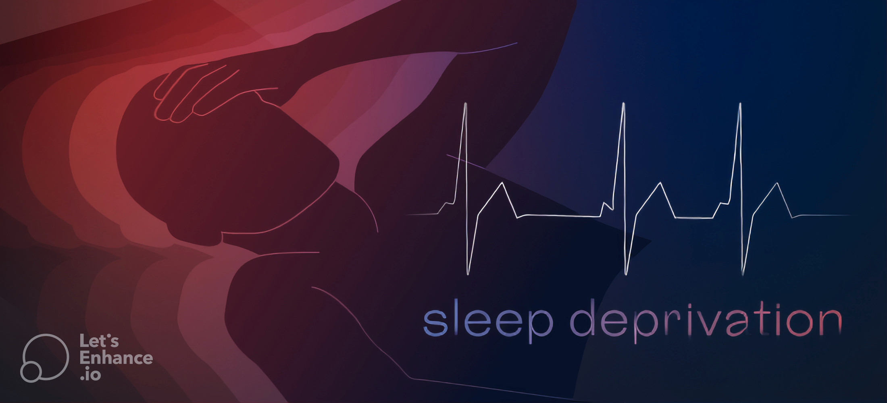
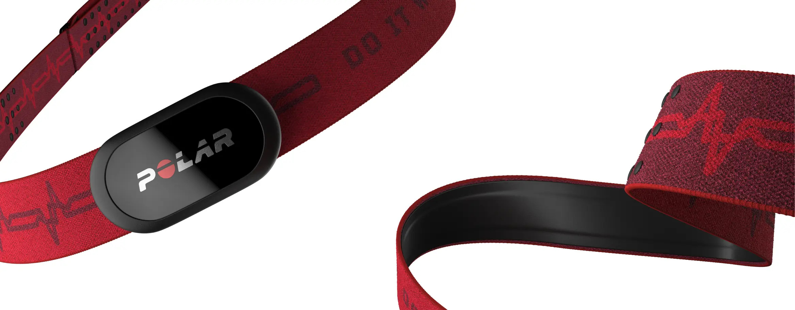
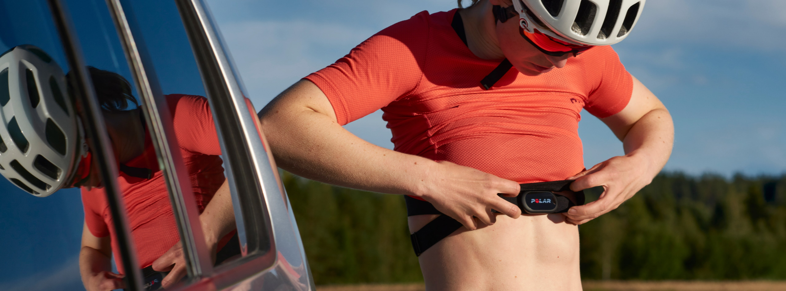

# Sleep deprivation and Heart Rate Variability (HRV) 

 ## Description
 This repository is dedicated to a study group project. The aim of this project is to learn to collect and manipulate physiological signals and data obtained with the Polar H10 belt while addressing a scientific question. 
 

 ### Tools
 1. The [Polar H10](https://www.polar.com/en/sensors/h10-heart-rate-sensor) belt is equipped with a heart rate sensor that is capable of performing single-lead electrocardiograms (ECG) wand was used to collect the data.

 2. [Elite HRV](https://elitehrv.com/) app (Android and iOS) was paired with the belts and used to record the cardiac electrical activity and exports the amplitudes as txt files.

 3. The software [Kubios](https://www.kubios.com/) was used to perform the preprocessing, and calculations on the ECG data to estimate the spectral powers (HF,LF), determine the heart rate variability (RMSSD & SDNN) and characterize the RR intervals (pNN50,mean,sd).

 4. An R script was developed to provide statistical visualization of the processed data and facilitate time and frequency analysis and interpretation.

 

  &nbsp;&nbsp;&nbsp;&nbsp;
  &nbsp;&nbsp;&nbsp;&nbsp;
  &nbsp;&nbsp;&nbsp;&nbsp;
  

 
 ### Scientific question

The scientific question we aimed to investigate was the effect of sleep deprivation on Heart Rate Variability (HRV).

Our hypothesis, informed by the publications listed in the [Bibliography](##Bibliography) and an educated assumption, was that sleep deprivation impairs Heart Rate Variability.

 ### Data collection
 
 The Polar belt was used to record ECG data directly on the project members (n=3).
 
 Each participant performed a short recording session of its heart activity in the morning just after awakening using the polar belt.
 The recording session consists of two recordings, one for each position of the participant:
1. In a supine position (lying on the back)
2. In an orthostatic position (standing up after lying down)

 Each recording had a duration of 10 minutes and was done using the participant smartphone with the Elite HRV app (Android and iOS). The analysis was systematically made on a 6 min range 2 min after the recording started.

 #### Experimental protocol
 To test the effect of sleep deprivation on HRV using Polar ECG belt each participant undertook the following 3 phases one for each condition:
 - Phase 1:
    - Control condition : participant does not change its sleeping habits (bedtime, duration, wake time)
    - Duration: 1 Week
 - Phase 2:
    - Sleep deprivation condition: participant can't sleep more than 4 hours per night.
    - Duration: 4 Days
 - Phase 3: 
    - Recovery phase: participant can sleep as much as they need to feel rested.
    - Duration: 4 Days.
 During each phase of the experiment, the participants recorded their heart activity daily following the method described in [Data collection](###Data_collection).

## Installation

1. Install `R 4.2.2` and Rstudio.
2. Download the project's latest release.
3. Open the `Programme_analyse.Rproj` file to open the project.
4. Use the command `renv::restore()` to replicate the virtual environements and get the packages.
5. Execute the script `Script_Analyse.R` located in the `Src` folder.
6. Select the data generated by kubios and exported as an excel file `.xlsx`

## Bibliography
- Besson, Cyril, Mathieu Saubade, Vincent Gremeaux, Grégoire p. Millet, et Laurent Schmitt. « Analyse de la variabilité de la fréquence cardiaque : méthodes, limites et exemples cliniques ». Revue Médicale Suisse 16, nᵒ 701 (2020): 1432‑37. https://doi.org/10.53738/REVMED.2020.16.701.1432.
- Castro-Diehl, Cecilia, Ana V. Diez Roux, Susan Redline, Teresa Seeman, Paula McKinley, Richard Sloan, et Steven Shea. « Sleep Duration and Quality in Relation to Autonomic Nervous System Measures: The Multi-Ethnic Study of Atherosclerosis (MESA) ». Sleep 39, nᵒ 11 (1 novembre 2016): 1927‑40. https://doi.org/10.5665/sleep.6218.
- Dettoni, Josilene L., Fernanda Marciano Consolim-Colombo, Luciano F. Drager, Marcelo C. Rubira, Silvia Beatriz P. Cavasin de Souza, Maria Claudia Irigoyen, Cristiano Mostarda, et al. « Cardiovascular Effects of Partial Sleep Deprivation in Healthy Volunteers ». Journal of Applied Physiology (Bethesda, Md.: 1985) 113, nᵒ 2 (juillet 2012): 232‑36. https://doi.org/10.1152/japplphysiol.01604.2011.
- Deus, Lysleine Alves, Caio Victor Sousa, Thiago Santos Rosa, José Morais Souto Filho, Patrick Anderson Santos, Lucas Duarte Barbosa, Samuel Silva Aguiar, Luiz Humberto Rodrigues Souza, et Herbert Gustavo Simões. « Heart Rate Variability in Middle-Aged Sprint and Endurance Athletes ». Physiology & Behavior 205 (1 juin 2019): 39‑43. https://doi.org/10.1016/j.physbeh.2018.10.018.
- Gardier, Stéphany. « Le développement de capteurs bon marché et d’applications dévolues a démocratisé le recours à l’analyse de la variabilité de la fréquence cardiaque. Si ses promesses sont grandes, la méthode présente des limites. », s. d.
- Jarrin, Denise C., Pasquale K. Alvaro, Marc-André Bouchard, Stephanie D. Jarrin, Christopher L. Drake, et Charles M. Morin. « Insomnia and Hypertension: A Systematic Review ». Sleep Medicine Reviews 41 (octobre 2018): 3‑38. https://doi.org/10.1016/j.smrv.2018.02.003.
- Marsac, Jean. « Variabilité de la fréquence cardiaque : un marqueur de risque cardiométabolique en santé publique ». Bulletin de l’Académie Nationale de Médecine 197, nᵒ 1 (janvier 2013): 175‑86. https://doi.org/10.1016/S0001-4079(19)31635-8.
- Zhong, Xu, H. John Hilton, Gregory J. Gates, Sanja Jelic, Yaakov Stern, Matthew N. Bartels, Ronald E. Demeersman, et Robert C. Basner. « Increased Sympathetic and Decreased Parasympathetic Cardiovascular Modulation in Normal Humans with Acute Sleep Deprivation ». Journal of Applied Physiology (Bethesda, Md.: 1985) 98, nᵒ 6 (juin 2005): 2024‑32. https://doi.org/10.1152/japplphysiol.00620.2004.
